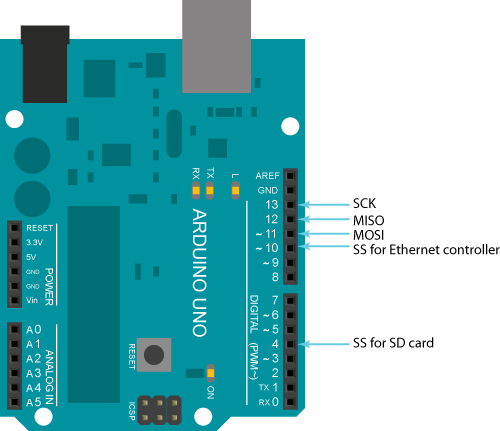
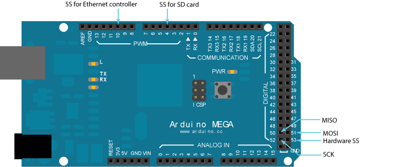

# Ethernet library

This library is designed to work with the Arduino Ethernet Shield, Arduino Ethernet Shield 2, Leonardo Ethernet, and any other W5100/W5200/W5500-based devices. The library allows an Arduino board to connect to the Internet. The board can serve as either a server accepting incoming connections or a client making outgoing ones. The library supports up to eight (W5100 and boards with <= 2 kB SRAM are limited to four) concurrent connections (incoming, outgoing, or a combination).

The Arduino board communicates with the shield using the SPI bus. This is on digital pins 11, 12, and 13 on the Uno and pins 50, 51, and 52 on the Mega. On both boards, pin 10 is used as SS. On the Mega, the hardware SS pin, 53, is not used to select the Ethernet controller chip, but it must be kept as an output or the SPI interface won't work.

To use this library:

```
#include <SPI.h>
#include <Ethernet.h>
```






## Examples
* [ChatServer](https://www.arduino.cc/en/Tutorial/ChatServer): set up a simple chat server.
* [WebClient](https://www.arduino.cc/en/Tutorial/WebClient): make a HTTP request.
* [WebClientRepeating](https://www.arduino.cc/en/Tutorial/WebClientRepeating): Make repeated HTTP requests.
* [WebServer](https://www.arduino.cc/en/Tutorial/WebServer): host a simple HTML page that displays analog sensor values.
* [BarometricPressureWebServer](https://www.arduino.cc/en/Tutorial/BarometricPressureWebServer): outputs the values from a barometric pressure sensor as a web page.
* [UDPSendReceiveString](https://www.arduino.cc/en/Tutorial/UDPSendReceiveString): Send and receive text strings via UDP.
* [UdpNtpClient](https://www.arduino.cc/en/Tutorial/UdpNtpClient): Query a Network Time Protocol (NTP) server using UDP.
* [DnsWebClient](https://www.arduino.cc/en/Tutorial/DnsWebClient): DNS and DHCP-based Web client.
* [DhcpChatServer](https://www.arduino.cc/en/Tutorial/DhcpChatServer): A simple DHCP Chat Server
* [DhcpAddressPrinter](https://www.arduino.cc/en/Tutorial/DhcpAddressPrinter): Get an IP address via DHCP and print it out
* [TelnetClient](https://www.arduino.cc/en/Tutorial/TelnetClient): A simple Telnet client
